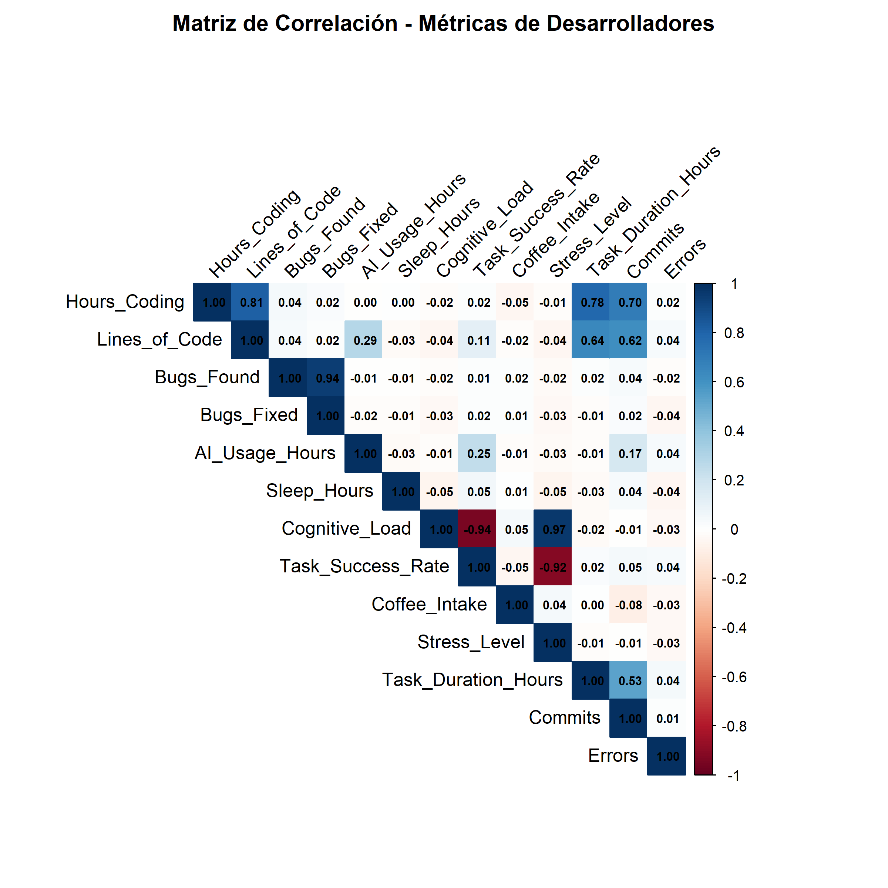
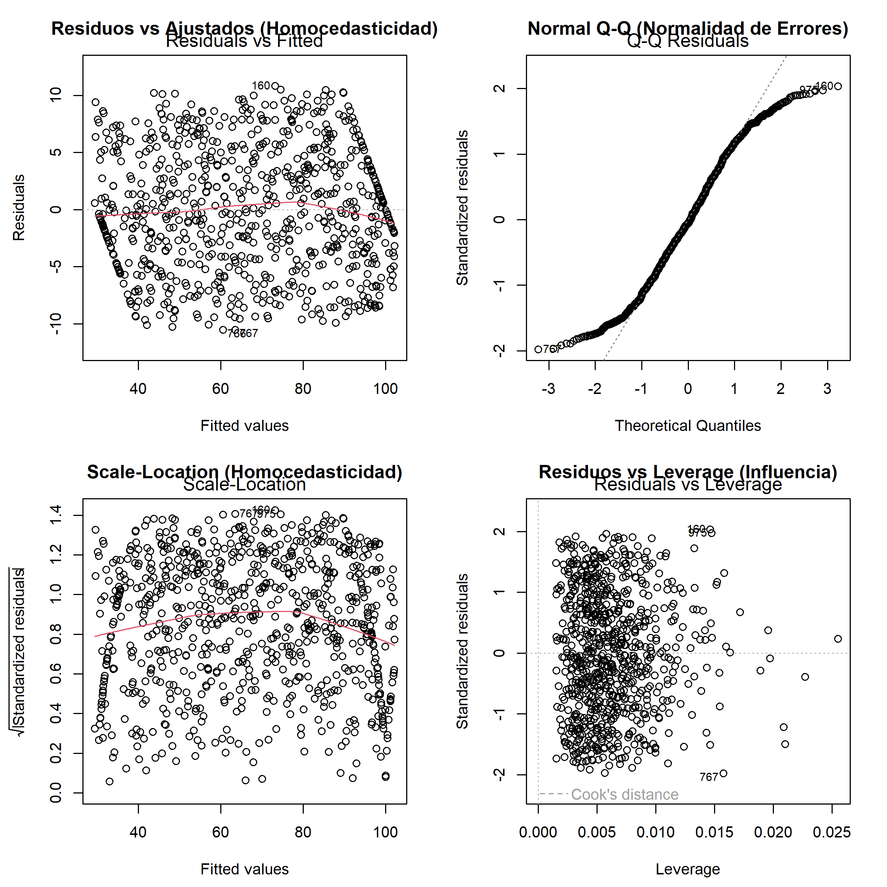
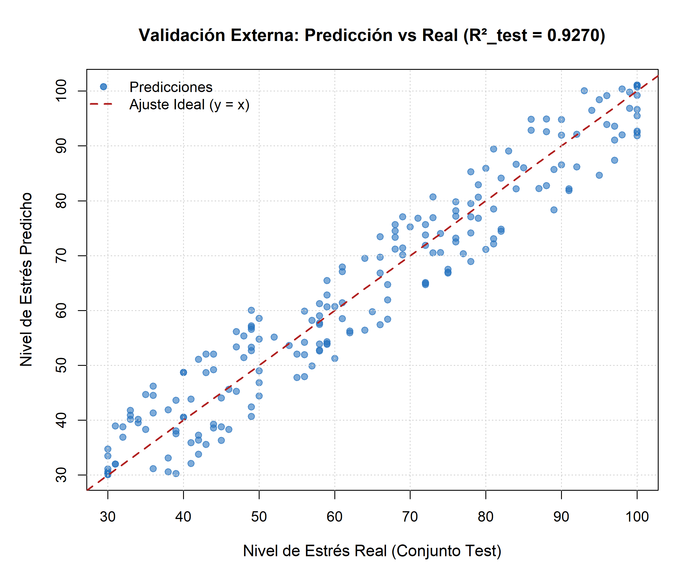

# 🧠 Modelado Estadístico del Nivel de Estrés en Desarrolladores de Software a partir de Métricas de Productividad y Carga Cognitiva

[](https://www.r-project.org/)
[](https://posit.co/)
[](https://www.latex-project.org/)
[](https://en.wikipedia.org/wiki/Ordinary_least_squares)


---

## 📌 Descripción General

Este repositorio contiene el desarrollo completo del proyecto de investigación y modelado estadístico **"Modelado Estadístico del Nivel de Estrés en Desarrolladores de Software a partir de Métricas de Productividad y Carga Cognitiva"**, elaborado para la asignatura de **Modelos Estocásticos y Estadística Inferencial** de la **Universidad Politécnica Salesiana** (Quito, Ecuador).

El objetivo central consiste en identificar qué variables cuantitativas de productividad, desempeño y demanda mental explican de manera estadísticamente significativa el nivel de estrés autopercibido por ingenieros de software asistidos por herramientas de inteligencia artificial.

El estudio analiza un conjunto de datos de **1,000 observaciones**, evaluando supuestos de regresión lineal múltiple (OLS), multicolinealidad, detección de observaciones influyentes y validación externa en datos no observados.

---

## 📄 Artículos Científicos (Papers)

El proyecto cuenta con dos versiones del artículo en formato formal para conferencias:

* 📥 **[Descargar Paper en Formato IEEE (PDF)](paper/ieee/Paper_IEEE.pdf)**
* 📥 **[Descargar Paper en Formato EasyChair (PDF)](paper/easychair/Paper_EasyChair.pdf)**

---

## 📂 Estructura del Repositorio

```text
modelo-estres-devs/
├── data/
│   └── AI_Developer_Performance_Extended_1000.csv  # Dataset completo (1000 registros)
├── scripts/
│   └── modelo_estres_devs.R                        # Script de modelado estadístico y evaluación
├── paper/
│   ├── ieee/
│   │   ├── paperieee.tex                           # Fuente LaTeX formato IEEE
│   │   └── Paper_IEEE.pdf                          # Documento compilado
│   └── easychair/
│       ├── papereasychair.tex                      # Fuente LaTeX formato EasyChair
│       ├── easychair.cls                           # Clase de estilo LaTeX
│       └── Paper_EasyChair.pdf                     # Documento compilado
├── results/
│   └── figures/                                    # Gráficos generados en alta resolución (300 DPI)
│       ├── matriz_correlacion.png
│       ├── diagnostico_residuales.png
│       └── prediccion_vs_real.png
├── modelo-estres-devs.Rproj                        # Proyecto de RStudio
├── .gitignore
└── README.md
```

---

## 🎯 Objetivos

### Objetivo General
Construir un modelo de regresión lineal múltiple (OLS) parsimonioso y estadísticamente robusto capaz de explicar y predecir el nivel de estrés de desarrolladores de software a partir de variables de productividad y carga mental.

### Objetivos Específicos
1. **Curaduría y preparación**: Limpieza de registros y verificación de calidad de datos.
2. **Análisis Exploratorio (EDA)**: Evaluar correlaciones de Pearson y detectar multicolinealidad bilateral.
3. **Selección de Variables**: Implementar *Backward Elimination* iterativo optimizando el $R^2$ ajustado.
4. **Diagnóstico de Supuestos**: Evaluar normalidad de errores, homocedasticidad, outliers studentizados y distancia de Cook.
5. **Validación Externa**: Medir el poder de generalización sobre un conjunto de prueba independiente (20%).

---

## 📊 Dataset Utilizado

* **Nombre del Dataset**: `AI_Developer_Performance_Extended_1000.csv`
* **Observaciones**: 1,000 registros
* **Variable Dependiente (Target)**: `Stress_Level` (Escala continua de nivel de estrés)
* **Variables Predictoras Iniciales (12)**:
  * `Hours_Coding`: Horas dedicadas a programación.
  * `Lines_of_Code`: Líneas de código escritas.
  * `Bugs_Found`: Fallos encontrados.
  * `Bugs_Fixed`: Fallos corregidos.
  * `AI_Usage_Hours`: Horas de asistencia con herramientas de IA.
  * `Sleep_Hours`: Horas de sueño reportadas.
  * `Cognitive_Load`: Carga cognitiva estimada.
  * `Task_Success_Rate`: Tasa de éxito en resolución de tareas.
  * `Coffee_Intake`: Consumo de café.
  * `Task_Duration_Hours`: Duración promedio de tareas.
  * `Commits`: Cantidad de confirmaciones realizadas.
  * `Errors`: Errores de compilación o ejecución.

---

## 🏗️ Metodología y Resultados

### 1️⃣ Limpieza y Partición de Datos
* Se verificó la consistencia y ausencia de valores nulos (`na.omit`).
* Partición aleatoria con semilla reproducible (`set.seed(123)`):
  * **80% Entrenamiento** ($n = 800$)
  * **20% Prueba** ($n = 200$)

### 2️⃣ Análisis Exploratorio y Multicolinealidad
Se evaluó la matriz de correlaciones entre todas las variables cuantitativas:

<p align="center">
  
</p>

* Se identificaron correlaciones fuertes esperadas entre `Cognitive_Load` y `Stress_Level` ($r = 0.9686$), así como una relación inversa con `Task_Success_Rate` ($r = -0.9195$).
* No se evidenciaron problemas de multicolinealidad severa que distorsionaran la estimación de coeficientes tras la selección.

### 3️⃣ Selección de Variables (Backward Elimination)
A partir del modelo saturado (12 predictores), el procedimiento eliminó iterativamente las variables menos significativas según su valor-$p$, seleccionando el modelo óptimo con 4 variables clave:
* `Lines_of_Code`
* `Cognitive_Load`
* `Task_Success_Rate`
* `Task_Duration_Hours`

**Ecuación del Modelo Final:**
$$\text{Stress Level} = 19.8920 - 0.0014(\text{Lines of Code}) + 0.9002(\text{Cognitive Load}) - 0.0820(\text{Task Success Rate}) + 0.0450(\text{Task Duration Hours})$$

```r
Stress_Level = 19.8920 - 0.0014 * Lines_of_Code + 0.9002 * Cognitive_Load - 0.0820 * Task_Success_Rate + 0.0450 * Task_Duration_Hours
```

---

### 4️⃣ Diagnóstico del Modelo y Supuestos Estadísticos

<p align="center">
  
</p>

* **Homocedasticidad**: Los residuos muestran dispersión homogénea a lo largo de los valores ajustados.
* **Normalidad**: El gráfico Normal Q-Q confirma que los residuos siguen adecuadamente la distribución normal teórica.
* **Observaciones Influyentes**: Ninguna observación superó el umbral crítico de distancia de Cook ($D_i > 1$), garantizando la estabilidad de los estimadores.

---

### 5️⃣ Validación Externa en Datos de Prueba (20%)

El modelo ajustado se evaluó sobre las 200 observaciones no observadas del conjunto de prueba:

<p align="center">
  
</p>

| Métrica | Valor Obtenido |
| :--- | :--- |
| **$R^2$ (Entrenamiento)** | **0.9413** (94.1% de variabilidad explicada) |
| **$R^2$ Ajustado** | **0.9410** |
| **Error Estándar Residual ($\sigma$)** | **5.3538** |
| **Estadístico $F$** | **3,184.75** ($p < 0.001$) |
| **$R^2$ de Prueba ($R^2_{test}$)** | **0.9270** (Excelente capacidad predictiva) |
| **Correlación al Cuadrado** | **0.9270** |

---

## 🚀 Puesta en Marcha

### Prerrequisitos
* **R** (versión 4.0 o superior)
* **RStudio** (recomendado)

### 1. Clonar el repositorio
```bash
git clone https://github.com/aledash3/modelo-estres-devs.git
cd modelo-estres-devs
```

### 2. Ejecutar con RStudio
1. Abre el archivo **`modelo-estres-devs.Rproj`** con RStudio (configurará el directorio de trabajo automáticamente).
2. Abre el script `scripts/modelo_estres_devs.R`.
3. Ejecuta el script completo (Ctrl + Shift + Enter o Source). El script se encargará de verificar dependencias y generar las gráficas en `results/figures/`.

### 3. Ejecutar desde terminal (Línea de comandos)
```bash
Rscript scripts/modelo_estres_devs.R
```

---

## 🔬 Conclusiones Principales

1. **Impacto de la Carga Cognitiva**: La variable `Cognitive_Load` resultó ser el factor más determinante y con mayor significancia estadística ($t = 34.15$, $p < 0.001$) para explicar el incremento del nivel de estrés.
2. **Factor Protector**: La tasa de éxito en las tareas (`Task_Success_Rate`) actúa como un mitigador significativo ($p = 0.003$), indicando que el logro efectivo reduce la percepción de estrés.
3. **Generalización**: La similitud entre el $R^2$ de entrenamiento ($0.9413$) y el de prueba ($0.9270$) confirma que el modelo no sufre de sobreajuste (*overfitting*).

---

## 👨‍💻 Autores

Este proyecto fue desarrollado de forma colaborativa por:

* **David Alejandro Cruz Palacios** — [@aledash3](https://github.com/aledash3)
* **Elvis Paúl García Acevedo** — [@P1RULA1S](https://github.com/P1RULA1S)
* **Naim Andre Michelena Andrade** — [@Andrexzx](https://github.com/Andrexzx)
* **Emily Mabel Ortega Constante** — [@BOOTEABLE](https://github.com/BOOTEABLE)
* **Carlos José Pilatuña Roldan** — [@Katsuro03](https://github.com/Katsuro03)
* **Mario Alexander Salazar Serna** — [@mario-alexander-salazar](https://github.com/mario-alexander-salazar)

Carrera de Ciencias de la Computación — Facultad de Ingeniería  
**Universidad Politécnica Salesiana (UPS)**  
Sede Quito, Ecuador

---

## 👨‍🏫 Tutor Académico

* **Dr. Diego Fernando Vallejo Huanga**  
  *Docente Investigador — Universidad Politécnica Salesiana*

---

## 📜 Licencia

Este proyecto fue desarrollado exclusivamente con fines **académicos, educativos y de investigación** dentro de la **Universidad Politécnica Salesiana (UPS)**.

Todos los derechos reservados conforme a las normativas de desarrollo académico e institucional. Prohibida su reproducción o explotación comercial sin autorización expresa.
